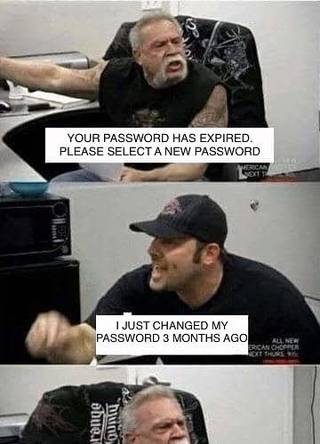

title: Password is 💀
author:
  name: I'm Adrien, frontend developer
  email: a.gibrat@oodrive.com
theme: ./theme
controls: false
output: index.html

--

# Password is 💀

-- screen full

--

## Password sucks

2018: [The begining of "The end of passwords"](https://www.microsoft.com/en-us/security/technology/identity-access-management/passwordless)

not secure <small>[haveibeenpwned](https://haveibeenpwned.com/unifiedsearch/s.deremur%40oodrive.fr): 8 506 873 299 accounts</small> 
not user friendly <small>[complex password = ugly UX](https://uxplanet.org/why-complex-passwords-are-bad-design-and-5-ways-to-do-better-affcc4516406)</small> 

--

### Password policies 💩

[ANSSI](https://www.ssi.gouv.fr/guide/mot-de-passe/ "Agence Nationale de la Sécurité des Systèmes d'Information") ⚡ [NIST](https://pages.nist.gov/800-63-3/sp800-63b.html#sec5 "National Institute of Standards and Technology")

do not reuse password 
prefer passphrase 
force special characters 
force periodic password changes 
check against lists (weak, common, leaked, etc.) 

-- screen full

-- screen full

### <small>Covers</small> various use cases

> Successful for multiple pipeline types

- Single Page Applications <small class="fragment">[build](https://docs.gitlab.com/ce/ci/examples/), [release](https://docs.gitlab.com/ce/workflow/releases.html) & [deploy](https://docs.gitlab.com/ce/topics/autodevops/)</small>
- Components & libraries <small class="fragment">[test](https://about.gitlab.com/2018/02/05/test-all-the-things-gitlab-ci-docker-examples/) & [publish](https://about.gitlab.com/stages-devops-lifecycle/package/)</small>
- End2end tests <small class="fragment">[scheduled executions](https://docs.gitlab.com/ce/user/project/pipelines/schedules.html) & [aggregate data](https://about.gitlab.com/2016/08/26/ci-deployment-and-environments/)</small>
- Documentations & tasks <small class="fragment">[hosted by gitlab pages](https://docs.gitlab.com/ce/user/project/pages/)</small>

--

# What does it look like ?

Few examples how we use Gitlab CI

-- screen

### Pipelines show jobs status at each step

Visible pipeline details <small>[in Merge Request view ](https://about.gitlab.com/2016/07/29/the-basics-of-gitlab-ci/)</small>

-- screen full

### Jobs log task execution & keep artifacts

Easy to read logs <small>[ansi colors support](https://gitlab.com/gitlab-org/gitlab-ce/issues/37898)</small>

Save artifacts between jobs <small>[to access it later](https://docs.gitlab.com/ce/user/project/pipelines/job_artifacts.html)</small>

-- screen large

### Using template allow DRY CI settings

Reusable versioned templates <small>[with include & extends](https://docs.gitlab.com/ce/ci/yaml/#include)</small>

--

## Last tips

- [Package tools](https://docs.gitlab.com/ce/ci/docker/using_docker_build.html) with [Docker](https://github.com/wsargent/docker-cheat-sheet)
- Script with your [favorite language](https://nodejs.org/en/docs/es6/), glue with [Bash](https://devhints.io/bash)
- [Maven project](https://www.unix-experience.fr/gitlab/gitlab_ci_maven_pipeline/) can enjoy Gitlab CI too 
- Use core features today, [check new features](https://about.gitlab.com/direction/#cicd "not free yet?") often
