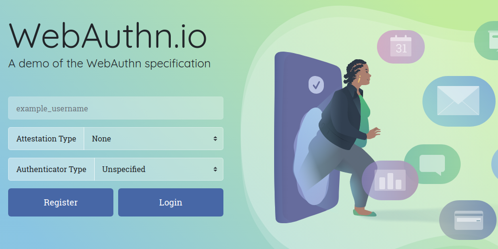
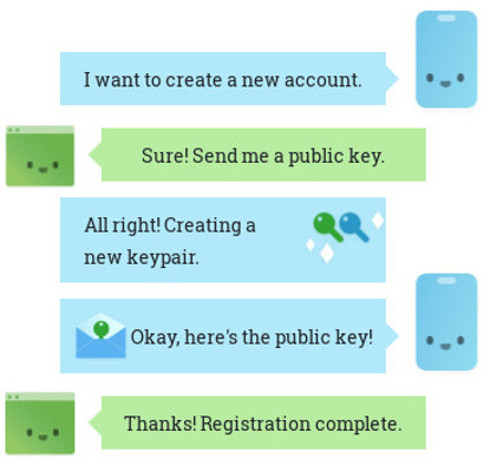
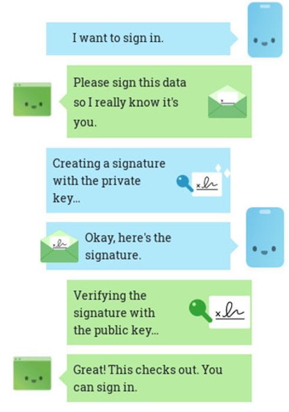

title: Password 💀
author:
  name: I'm Adrien, frontend developer
  email: a.gibrat@oodrive.com
theme: ./theme
controls: false
output: index.html

--

# Password 💀

--

## Password sucks

Since 2018, Microsoft advocate [The beginning of "The end of passwords"](https://www.microsoft.com/en-us/security/technology/identity-access-management/passwordless)

not secure <small>[haveibeenpwned](https://haveibeenpwned.com/unifiedsearch/s.deremur%40oodrive.fr) 408 leaked
dataset = 8 506 873 299 accounts</small> 
not user friendly <small>[password = complexity](https://uxplanet.org/why-complex-passwords-are-bad-design-and-5-ways-to-do-better-affcc4516406) your mom doesn't use a password manager</small> 

-- screen full

--

### Password policies 💩

various best practices [ANSSI](https://www.ssi.gouv.fr/guide/mot-de-passe/ "Agence Nationale de la Sécurité des Systèmes d'Information") ⚡ [NIST](https://pages.nist.gov/800-63-3/sp800-63b.html#sec5 "National Institute of Standards and Technology")

never reuse password 
use passphrase 
check against lists (contextual, dictionary, common, leaked…) 
SMS is [not secure](https://www.bankinfosecurity.com/heres-account-authentication-shouldnt-use-sms-a-11708) OTP (PSD2: banking deprecated SMS) 
force special characters <small>leet `Oodrive$1`</small> 
force periodic password changes <small>#… `Oodrive9`</small> 

-- screen large

### Forget password 😡

-- screen large

### Expired password 🤬 

-- screen

## FIDO <small class="fragment">[alliance](https://fidoalliance.org/members/)</small> 👀

Fast ID online <small>[Solving the World's Password Problem](https://fidoalliance.org/what-is-fido/)</small>

--

### Specifications 🤖

- FIDO U2F <small>Universal *Second Factor authentication*</small> <small class="fragment">using asymetric cryptography with USB security key (+ NFC / BLE)</small>
- FIDO UAF <small>Universal Authentication Framework</small> <small class="fragment">*Passwordless Authentication* with biometrics & external security device</small>
- FIDO2 [W3C WebAuthn](https://www.w3.org/TR/webauthn-1/) <small>(March 2019) API for accessing Public Key</small> <small class="fragment">Secure passwordless & multi-factor authentication for the web</small>

-- screen

### Client to Authenticator Protocol 🤓

 = cryptographic & biometric proof, NOT SMS<small>™</small>  

[CTAP 2](https://en.wikipedia.org/wiki/Client_to_Authenticator_Protocol) = WebAuthn authenticator specification
 (CTAP 1 = U2F only)

-- screen

### FIDO 2 support 💪

[Windows 10](https://fidoalliance.org/microsoft-achieves-fido2-certification-for-windows-hello/), [Android 7+](https://fidoalliance.org/android-now-fido2-certified-accelerating-global-migration-beyond-passwords/)(1B+ devices) & all evergreen browsers, including [Safari](https://webkit.org/blog/8517/release-notes-for-safari-technology-preview-71/)

-- screen

## Demo 👩‍💻

https://webauthn.io

-- screen

### Simple worklow 🤗

**Registration**

**Login**

--

### Password is dead, long live the password 👑

> [300 billion passwords by 2020  $6 trillion annual damage by 2021](https://thycotic.com/wp-content/uploads/2013/03/Cybersecurity-Ventures-Thycotic_Password-Protection.pdf)

> [Do FIDO2 passwordless & WebAuthn](https://developer.mozilla.org/en-US/docs/Web/API/Web_Authentication_API) today!
>  FIDO is already a [requirement for banking](https://fidoalliance.org/fido-standards-meet-psd2-sca-requirements/)  and will be one soon for other regulated industries.
